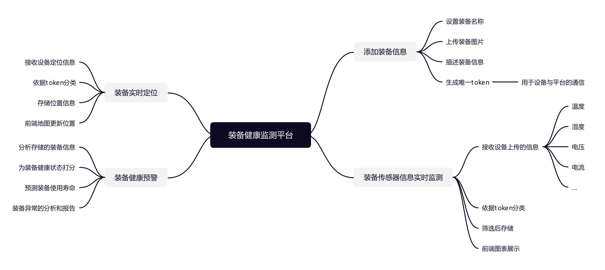
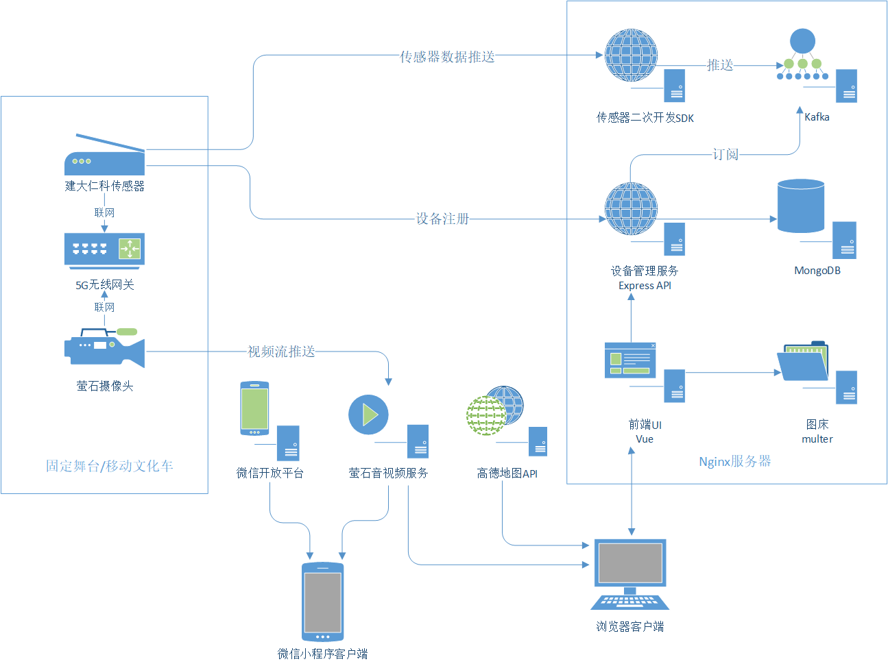

# 装备健康监测平台

## 开发

- 前端 `equipment-front` 使用 `vue` + `bootstrap` + `ant-design`，地图采用[`高德地图API`](https://lbs.amap.com/api/jsapi-v2/guide/webcli/map-vue1)
- 后端 `equipment-back` 使用 `express` + `mongodb`
- 图床 `equipment-image` 使用 `express` + `multer`

## 项目框架


<!-- https://www.processon.com/view/link/61a9dbd5f346fb733cd80d02#map -->

## 软件架构



## 运行

1. 生成`ssl`证书，参考`gen-ssl.sh`。

2. 生成有关`token`的`RSA`密钥。

```sh
sh gen-key.sh
```

3. 部署

```sh
docker-compose up -d --build
```
